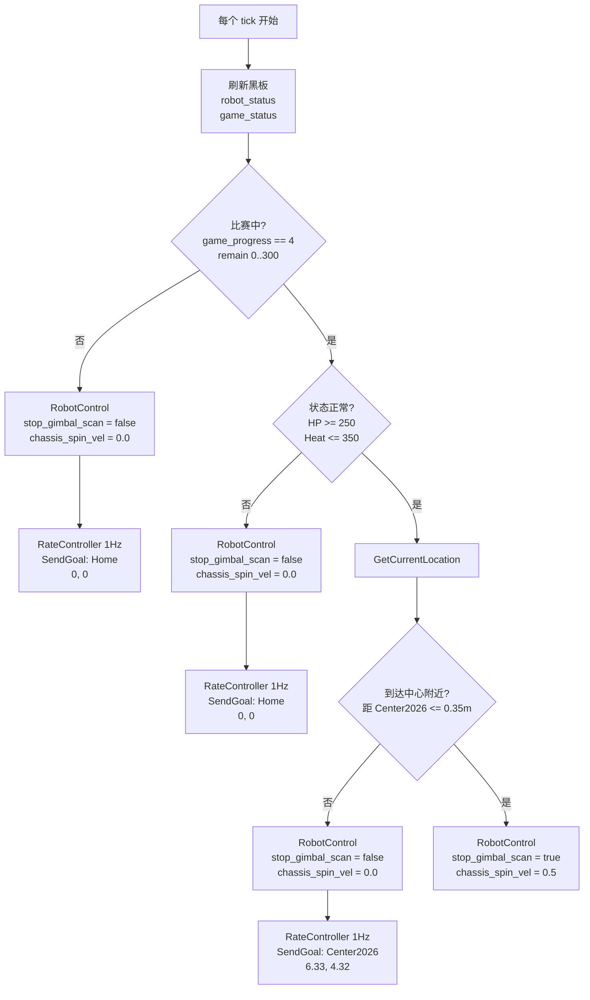

# 当前行为树流程图

<div align="center">

[](README_BEHAVIOR_TREE_FLOW.md)
[](README_BEHAVIOR_TREE_FLOW_EN.md)

</div>

最后更新：2026-04-11

## 0. 文档定位（五文分工）

| 文档 | 职责 |
|------|------|
| [README.md](README.md) | **中央索引**：一页总览、架构简图、编译顺序、最短启动 |
| [README_COMMUNICATION.md](README_COMMUNICATION.md) | **通讯与协议全文**：`sentry_bridge`、SP/SX/ST、PTY、帧、`serial_sender`、`bt_comm_adapter`、话题；[§15.3 实机通讯摘要](README_COMMUNICATION.md#153-实机联调通讯视角摘要) |
| **本文** | **行为树全文**：策略 XML、流程图、节点与插件、`RobotControl`/`SendGoal` 语义、Groot2、调试脚本、旧树索引；**§5.1** 目标点与 `watch_*` 对齐 |
| [README_LIDAR.md](README_LIDAR.md) | **激光雷达 + SLAM + Nav2**：**§6.4 Gazebo Sim2Real**、Mid360、FAST-LIO、建图；**§10.8** 实机导航前提 |
| [README_COMMANDS.md](README_COMMANDS.md) | **命令与数据流**：[§1 四路径数据链](README_COMMANDS.md#1-完整数据链路与职责划分)、[§4 `start_robot` 变量](README_COMMANDS.md#4-nav_wsstart_robotsh调试用环境变量详解)、[§12 实机联调](README_COMMANDS.md#12-实机联调) |

**如何选读：** 改 XML / 理解决策与 `RobotControl` → **本文**；串口与下位机协议 → [README_COMMUNICATION.md](README_COMMUNICATION.md)；雷达与定位不稳 → [README_LIDAR.md](README_LIDAR.md)；复制命令、环境变量、地图文件名含义、分阶段实机步骤 → [README_COMMANDS.md](README_COMMANDS.md)。

**与另文的边界：** 端到端 A–D 路径与 MCU 职责以 [README_COMMANDS.md §1](README_COMMANDS.md#1-完整数据链路与职责划分) 为准；**换图、`MAP_FILE`、PCD→PGM 命令**以 [README_COMMANDS.md](README_COMMANDS.md) **§4.4、§7** 为准，本文只强调 **树内坐标与 watcher 参数须与 XML 一致**（§5.1）。

---

这份文档优先说明当前默认调试树 **`center_attack_simple.xml`**，并补充框架级说明与 **`retreat_attack_left`** 等旧树索引。

先把“当前到底跑哪棵树”说清楚：

- 推荐调试 / 机械限制版：
  - `rm_decision_ws/rm_behavior_tree/config/center_attack_simple.xml`
- `run_test_a.sh` / `run_test_a_headless.sh` 当前默认启动：
  - `style:=center_attack_simple`
- `start_robot.sh` 现在默认也启动：
  - `style:=center_attack_simple`

所以如果你现在是在调“开赛去中心、到点驻守攻击、低血回家”这套逻辑，`run_test_a.sh` 和 `start_robot.sh` 已经对到同一棵树了。

## 1. 先说结论

`center_attack_simple.xml` 是一个面向当前机械限制的简化状态机：

- 比赛开始且状态正常：
  - 去 `RMUL2026` 中心附近自由点
  - 行进中保持云台扫描
  - 底盘不小陀螺
- 到达中心附近：
  - 停止扫描，把云台交给自瞄
  - 底盘原地小陀螺
  - 不再继续主动行进
- 未开赛，或低血 / 高热：
  - 返回初始点 `Home(0.8, 7.8)`
  - 云台继续 360 扫描
  - 底盘不小陀螺

它和旧树最大的区别是：

- 不再依赖视觉检测结果切战术
- 不再依赖 `/all_robot_hp`
- 不再做时间窗切点位
- 不再在行进过程中小陀螺
- 只保留你当前最想要的 3 个状态：
  - 待机 / 回家
  - 去中心
  - 中心驻守攻击

## 2. 对应代码入口

- 行为树主程序：
  - `rm_decision_ws/rm_behavior_tree/src/rm_behavior_tree.cpp`
- 当前简化树 XML：
  - `rm_decision_ws/rm_behavior_tree/config/center_attack_simple.xml`
- 新增到点判断节点：
  - `rm_decision_ws/rm_behavior_tree/plugins/condition/is_near_goal.cpp`
- Groot 工程：
  - `rm_decision_ws/rm_behavior_tree/config/Project.btproj`

## 3. 当前输入与输出

### 3.1 输入

这棵新树每个 tick 只读取 2 路输入：

- `robot_status`
- `game_status`

和旧树不同，当前简化树不依赖：

- `/detector/armors`
- `/all_robot_hp`

**说明：** 不订阅 `/detector/armors` **不等于**「视觉与决策无关」。自瞄与目标跟踪仍由 **视觉 → SP → MCU** 完成；本树通过 **`RobotControl`**（如 `allow_vision_control`、`scan_enabled` 等）切换 **扫描 / 允许自瞄接管** 等模式，**不把「是否看到装甲」写进 BT 分支条件**。详见 [README_COMMANDS.md](README_COMMANDS.md) 第 3.2 节。

### 3.2 输出

- `SendGoal`
  - 给 Nav2 的 `navigate_to_pose`
- `RobotControl`
  - 发布到 `/robot_control`
  - XML 中显式设置的主要字段包括（随驻守/行进分支变化）：
    - `stop_gimbal_scan`、`chassis_spin_vel`
    - `scan_enabled`、`allow_vision_control`、`search_when_target_lost`
    - `scan_yaw_rate_deg_s`、`search_pitch_deg`

## 4. 哪些输入是硬前提

- `game_status`
  - 最关键的门控输入
  - 如果没收到，或者 `game_progress != 4`，树不会进入比赛中主逻辑
- `robot_status`
  - 决定是否允许守中
  - 如果 `HP < 250` 或 `shooter_heat > 350`，树会直接回家

## 5. 关键目标点与阈值

当前 `center_attack_simple.xml` 里写死的是：

- `Home`
  - `(0.8, 7.8)`
- `Center2026`
  - `(6.33, 4.32)`
- `IsNearGoal` 距离阈值
  - `0.35 m`
- 驻守时底盘小陀螺速度
  - `0.5 rad/s`
- 状态阈值
  - `HP >= 250`
  - `shooter_heat <= 350`

之所以不是旧树里的 `OccupyCenter(3.0, 0.4)`，是因为那个点在当前 `RMUL2026.pgm` 上已经落在障碍区域里，不能直接复用。

### 5.1 `watch_center_attack_state.py` 与 XML 坐标对齐

`scripts/watch_center_attack_state.py` 里 **`d_home` / `d_center`** 用的参考点来自命令行参数，**默认值与上面 XML 写死的 `Home(0.8, 7.8)`、`Center2026(6.33, 4.32)` 不一定一致**（脚本默认曾为其它仿真/旧图坐标）。实机或换图后请**显式传入**与 **`center_attack_simple.xml` 相同的坐标**，例如：

```bash
python3 scripts/watch_center_attack_state.py \
  --home-x 0.8 --home-y 7.8 \
  --center-x 6.33 --center-y 4.32
```

换地图、改原点或场地方向时，**XML 中的 `SendGoal`、环境变量 `BT_START_GOAL` / `BT_END_GOAL`、以及 watcher 参数**应一并核对（测定工具见 [README_COMMANDS.md](README_COMMANDS.md) **§4.4、§7.4**）。

**实机分阶段联调、伪造 `/game_status` 与 `/robot_status`、BT 调试脚本**见 [README_COMMANDS.md §12](README_COMMANDS.md#12-实机联调)。

## 6. 主流程图



## 7. 按代码展开后的结构图

```text
ReactiveSequence
├─ SubRobotStatus(topic_name="robot_status")
├─ SubGameStatus(topic_name="game_status")
└─ WhileDoElse [比赛进行中?]
   ├─ TRUE -> WhileDoElse [HP>=250 且 Heat<=350 ?]
   │  ├─ TRUE -> WhileDoElse [距离 Center2026 <= 0.35m ?]
   │  │  ├─ TRUE  -> RobotControl(stop_gimbal_scan=True,  chassis_spin_vel=0.5)
   │  │  └─ FALSE -> ReactiveSequence
   │  │     ├─ RobotControl(stop_gimbal_scan=False, chassis_spin_vel=0.0)
   │  │     └─ SendGoal(Center2026)
   │  └─ FALSE -> ReactiveSequence
   │     ├─ RobotControl(stop_gimbal_scan=False, chassis_spin_vel=0.0)
   │     └─ SendGoal(HomeRecover)
   └─ FALSE -> ReactiveSequence
      ├─ RobotControl(stop_gimbal_scan=False, chassis_spin_vel=0.0)
      └─ SendGoal(HomeStandby)
```

## 8. 关键节点速查

### 8.1 `IsGameTime`

成功条件：

- `msg->game_progress == 4`
- 且 `stage_remain_time` 在给定区间内

在这棵树里的作用：

- 只负责判断“比赛是否已经开始”

### 8.2 `IsStatusOK`

成功条件：

- `current_hp >= hp_threshold`
- `shooter_heat <= heat_threshold`

在这棵树里固定使用：

- `HP >= 250`
- `Heat <= 350`

### 8.3 `GetCurrentLocation`

作用：

- 读取当前 `map -> base_link` 的 TF
- 给后面的 `IsNearGoal` 做位置判断

### 8.4 `IsNearGoal`

成功条件：

- 当前机器人位置到目标点的平面距离 `<= dist_threshold`

当前用于：

- 判断是否已经到达 `Center2026`

### 8.5 `RobotControl`

当前树已经通过一组功能量表达云台 / 底盘状态：

- `scan_enabled`
  - 是否启用云台扫描
- `allow_vision_control`
  - 是否允许视觉自瞄接管云台
- `search_when_target_lost`
  - 自瞄丢目标时是否回到扫描搜索
- `scan_yaw_rate_deg_s`
  - 扫描时的云台 yaw 角速度
- `search_pitch_deg`
  - 扫描 / 搜索时的目标 pitch
- `chassis_spin_vel`
  - 底盘小陀螺角速度
- `stop_gimbal_scan`
  - 旧兼容字段，仍可表达“停扫并允许接管”，但不再是唯一控制量

## 9. 当前通讯链路里它是怎么落到底盘的

这棵树输出的两条控制链目前分别是：

- `SendGoal -> Nav2 -> /cmd_vel -> /cmd_vel_chassis -> bt_comm_adapter.py -> /cmd_vel_chassis_bt`
- `/robot_control.chassis_spin_vel -> bt_comm_adapter.py -> /cmd_vel_chassis_bt`

然后再通过当前桥接链进入底盘：

- `/cmd_vel_chassis_bt -> serial_sender -> Radar PTY -> sentry_bridge.py -> SX -> nyush-rm-control`

也就是说：

- 导航移动已经能通过这棵树真正影响底盘
- `chassis_spin_vel` 也已经能通过适配层叠加到底盘速度里
- `/robot_control` 的功能字段现在也已经通过 `serial_sender(A3) -> sentry_bridge.py -> SX.control_flags/config -> nyush-rm-control` 落到下位机

也就是说，行为树到中心后已经可以同时做到“底盘小陀螺”“允许视觉自瞄接管云台”“丢目标时回到扫描搜索”，并且还能单独配置扫描角速度和搜索 pitch。

## 10. 这棵树当前不做什么

`center_attack_simple.xml` 当前故意不做这些事：

- 不看 `/detector/armors`
- 不看目标类别
  - 哨兵 / 步兵 / 英雄 / 前哨站
- 不做时间窗切换
- 不做左路 / 右路 / 补给区 / 中路多点位切换
- 不做被攻击后的 `MoveAround`

这是有意简化后的结果，目的是先让“去中心驻守”这套最小策略稳定跑起来。

## 11. 调试建议

如果你现在要调这棵树，最小只需要保证下面两路输入稳定：

- `game_status`
- `robot_status`

最小联调顺序：

1. 启动 Gazebo / Nav2
2. 启动行为树：
   - `style:=center_attack_simple`
3. 手动发布：
   - `game_status`
   - `robot_status`
4. 观察：
   - `/goal_pose`
   - `/robot_control`
   - Groot2 中的 `IsGameStart / IsStatusOK / IsNearGoal`

典型测试现象：

- `game_progress = 0`
  - 应回 `Home(0.8, 7.8)`
  - 扫描开启
  - 不小陀螺
- `game_progress = 4` 且 `HP = 600, heat = 0`
  - 应去 `Center2026(6.33, 4.32)`
  - 扫描开启
  - 不小陀螺
- 到 `Center2026` 附近后
  - 应 `stop_gimbal_scan=True`
  - 应 `chassis_spin_vel=0.5`
- `HP = 200` 或 `heat = 400`
  - 应回 `Home(0.8, 7.8)`
  - 扫描开启
  - 不小陀螺

## 12. 旧树现状说明

为了避免混淆，这里再强调一次：

- `retreat_attack_left.xml` 还在
- 但 `start_robot.sh` 现在默认已经切到 `center_attack_simple`
- 旧树仍然是那套“时间窗 + 是否见敌 + 友方血量”的复杂高层导航状态机，只在你显式指定 `BT_STYLE=retreat_attack_left` 时才建议再用

---

## 13. 程序入口、参数与插件注册

### 13.1 可执行入口与 tick

- **源码：** `rm_decision_ws/rm_behavior_tree/src/rm_behavior_tree.cpp`
- **行为：** 创建 `BehaviorTreeFactory`，按顺序注册插件，从 **XML 文件** 建树，然后 **`tree.tickWhileRunning(10ms)`** 循环执行。
- **Launch：** `ros2 launch rm_behavior_tree rm_behavior_tree.launch.py style:=<无后缀 XML 名> use_sim_time:=True/False`
  - 参数 **`style`** 会传给节点参数 **`style`**；launch 内通常展开为 `config/<style>.xml` 的绝对路径。

### 13.2 常用节点参数

| 参数 | 含义 |
|------|------|
| `style` | 加载的 BT XML（如 `center_attack_simple`） |
| `start_goal_pose` / `end_goal_pose` | 写入黑板的全局字符串，格式同 `goal_pose`（部分树或调试用） |
| `enable_groot` | 是否启用 Groot2 发布 |
| `groot_port` | Groot2 监听端口，默认 **1667** |

### 13.3 已注册的 ROS 订阅插件（`msg_update_plugin_libs`）

这些插件在工厂里 **先于** 普通插件注册，用于每 tick 把话题刷进黑板（具体黑板键名见各插件与 XML）：

| 动态库名 | 典型用途 |
|----------|----------|
| `sub_all_robot_hp` | `/all_robot_hp` |
| `sub_robot_status` | `robot_status`（XML 可改 topic 名） |
| `sub_game_status` | `game_status` |
| `sub_armors` | `/detector/armors` |

**注意：** `center_attack_simple.xml` **树内未使用** `SubArmors` / `SubAllRobotHP`，因此即使插件已注册，不引用即无行为依赖。

### 13.4 已注册的非 ROS 插件（`bt_plugin_libs`）

| 插件 | 类型倾向 | 说明 |
|------|----------|------|
| `rate_controller` | Decorator | 限制子节点执行频率（如 `SendGoal` 1 Hz） |
| `is_game_time` | Condition | 比赛阶段与时间窗 |
| `is_status_ok` | Condition | 血量、热量阈值 |
| `is_detect_enemy` | Condition | 装甲板列表是否非空 |
| `is_near_goal` | Condition | 到点距离（配合 `GetCurrentLocation`） |
| `is_attacked` | Condition | 是否被攻击 |
| `is_friend_ok` / `is_outpost_ok` | Condition | 友方/前哨站（裁判数据） |
| `get_current_location` | Action/Sync | 读 `map`→`base_link` |
| `move_around` | Action | 受击游走等 |

### 13.5 ROS 话题发布类插件（`RegisterRosNode`）

| 插件 | 默认话题 | 说明 |
|------|----------|------|
| `send_goal` | `goal_pose`（`params_send_goal`） | Nav2 `navigate_to_pose` |
| `robot_control` | `robot_control`（`params_robot_control`） | `RobotControl` 消息 |

---

## 14. `RobotControl` 消息与 `RobotControl` 节点端口

**定义文件：** `rm_decision_ws/rm_decision_interfaces/msg/RobotControl.msg`

| 字段 | 类型 | 含义 |
|------|------|------|
| `stop_gimbal_scan` | bool | 旧兼容：停扫并便于切自瞄 |
| `chassis_spin_vel` | float32 | 底盘小陀螺角速度 (rad/s)，经 `bt_comm_adapter` 进入 `/cmd_vel_chassis_bt.angular.z` |
| `scan_enabled` | bool | 是否启用扫描模式 |
| `allow_vision_control` | bool | 是否允许视觉自瞄接管 |
| `search_when_target_lost` | bool | 丢目标后是否回扫 |
| `scan_yaw_rate_deg_s` | float32 | 扫描 yaw 角速度 (deg/s) |
| `search_pitch_deg` | float32 | 扫描/搜索目标 pitch (deg) |

**节点实现：** `plugins/action/robot_control.cpp` — 对未在 XML 中连接的端口使用 **默认值 0 / false**，再 `getInput` 覆盖。

---

## 15. 配置文件清单（`rm_behavior_tree/config/*.xml`）

| 文件 | 用途 |
|------|------|
| `center_attack_simple.xml` | **默认**：去中心驻守 + 低血回家；仅 `game_status` + `robot_status` |
| `center_attack_fullstack.xml` | 全栈/扩展版（队内在用名可能与 launch 脚本一致，以实际 XML 为准） |
| `retreat_attack_left.xml` | 旧主赛策略：时间窗、见敌、友方血量、补给等 |
| `attack_left.xml` / `attack_right.xml` | 单侧进攻 |
| `protect_supply.xml` | 守补给 |
| `rmuc_01.xml` | RMUC 相关预设 |

切换示例：

```bash
BT_STYLE=retreat_attack_left ./start_robot.sh
# 或
ros2 launch rm_behavior_tree rm_behavior_tree.launch.py style:=retreat_attack_left
```

---

## 16. `retreat_attack_left` 逻辑结构（摘要）

> 完整端口与条件以 XML 为准；此处便于与 `center_attack_simple` 对比。

典型顶层结构（文字版）：

```text
ReactiveSequence（每 tick 刷新订阅）
├─ SubAllRobotHP, SubArmors, SubRobotStatus, SubGameStatus
└─ WhileDoElse [比赛进行中 game_progress=4]
   ├─ TRUE → 比赛主逻辑：见敌 / 状态 OK / 被攻击 / 时间段 / 友方血量 → 多分支 SendGoal + RobotControl
   └─ FALSE → 待机：回基地 + RobotControl 关闭自旋等
```

与 **简化树** 的差异：**强依赖** `/detector/armors`、`/all_robot_hp`，并有 **MoveAround**、多目标点与时间窗；调试前务必保证裁判与视觉话题有源或使用 `bt_comm_adapter` 等 fallback。

---

## 17. 与 Nav2、`bt_comm_adapter`、下位机的衔接（行为树视角）

```text
SendGoal → navigate_to_pose → Nav2 → /cmd_vel → fake_vel_transform → /cmd_vel_chassis
RobotControl → /robot_control ────────────────────────────────┐
                                                               ▼
                                              bt_comm_adapter → /cmd_vel_chassis_bt
                                                               → serial_sender → Radar PTY → … → MCU
```

- **平移**：主要来自 Nav2 → `/cmd_vel_chassis.linear.*`。
- **小陀螺**：来自 **`chassis_spin_vel`**，**不要依赖** Nav2 的 `angular.z` 进 `bt_comm_adapter`（实现见 `scripts/bt_comm_adapter.py`）。

---

## 18. 调试工具与脚本（本仓库 `scripts/`）

| 脚本 | 作用 |
|------|------|
| `bt_hotkey_debug.py` | 键盘模拟 `game_status` / `robot_status` 等，快速切分支（实机常用） |
| `watch_center_attack_state.py` | 终端打印与 `center_attack` 相关的状态（常与全栈脚本配合） |
| `run_test_a.sh` / `run_test_a_headless.sh` | **无雷达**：假传感器 + Nav2 + BT，默认 `style:=center_attack_simple` |
| `test_behavior_chain.py` | 行为链测试辅助 |
| `start_fullstack_sequence.sh` | **会弹多个 gnome-terminal**（cleanup / bridge / vision / nav / watch / hotkey）；日常联调更推荐按 `README_COMMUNICATION.md` 手动 2～3 终端 |
| `start_fullstack_headless.sh` | 无图形界面的后台拉起 + 日志目录（适合 systemd/无人值守） |

### 18.1 Groot2 建议流程

0. **启动 Groot2 客户端**（队内当前使用桌面 **AppImage**，文件名随版本变化）：

```bash
cd ~/Desktop
./Groot2-v1.9.0-x86_64.AppImage
```

与 **[mid360 command.txt](mid360%20command.txt)** §13 一致；若你本机是 `Groot2-*-x86_64.AppImage` 其它版本，以实际文件名为准。  

1. 启动 `rm_behavior_tree`（**必须** `enable_groot:=true`；`run_center_attack_debug_session.sh` 可用 **`ENABLE_GROOT=True`** 传给 launch）。  
2. 在 Groot2 中打开 **`rm_behavior_tree/config/Project.btproj`**。  
3. **Monitor** 模式连接 **`127.0.0.1:1667`**（或 launch 里改的 `groot_port`）。  
4. 免费版有节点数限制；可临时删减 XML 子树专调一条分支。

**Gazebo 仿真里联调**时，推荐顺序见 [README_LIDAR.md](README_LIDAR.md) **§6.4**（`bringup_sim` → `run_center_attack_debug_session.sh` → 本节的 Groot2）。

### 18.2 `goal_pose` 字符串格式

行为树里 **`SendGoal`** 使用的 **`goal_pose`** 格式为：

```text
x;y;z; qx;qy;qz;qw
```

由 `bt_conversions.hpp` 解析为 `geometry_msgs/PoseStamped`。注意 XML 中不要混入难以解析的前导空格（历史问题已用 `parseDouble`/trim 缓解）。

---

## 19. 相关源码路径（速查）

| 内容 | 路径 |
|------|------|
| 主程序 | `rm_decision_ws/rm_behavior_tree/src/rm_behavior_tree.cpp` |
| Groot 工程 | `rm_decision_ws/rm_behavior_tree/config/Project.btproj` |
| `RobotControl` 插件 | `rm_decision_ws/rm_behavior_tree/plugins/action/robot_control.cpp` |
| `SendGoal` | `rm_decision_ws/rm_behavior_tree/plugins/action/send_goal.cpp` |
| `IsNearGoal` | `rm_decision_ws/rm_behavior_tree/plugins/condition/is_near_goal.cpp` |
| 消息定义 | `rm_decision_ws/rm_decision_interfaces/msg/*.msg` |
| 通讯适配 | `sentry_planner/scripts/bt_comm_adapter.py` |

---

## 20. 与其它 README 的交叉引用

| 需求 | 文档 |
|------|------|
| 端到端数据链总览、实机终端与 `ros2 topic pub` | [README_COMMANDS.md](README_COMMANDS.md) **§1、§12、§13** |
| `RobotControl` 上 MCU 的协议与 `serial_sender` | [README_COMMUNICATION.md](README_COMMUNICATION.md) **§11** 等 |
| `MAP_FILE`、`11_map` / `RMUL2026`、换图改坐标 | [README_COMMANDS.md](README_COMMANDS.md) **§4.4、§7** |
| **Gazebo、`bringup_sim`、Sim2Real、伪造裁判调分支** | [README_LIDAR.md §6.4](README_LIDAR.md#nyush-gazebo-sim2real)、[mid360 command.txt](mid360%20command.txt) |
| `navigate_to_pose`、定位与场地一致 | [README_LIDAR.md](README_LIDAR.md) **§10.8** |
| 中央索引 | [README.md](README.md) |
