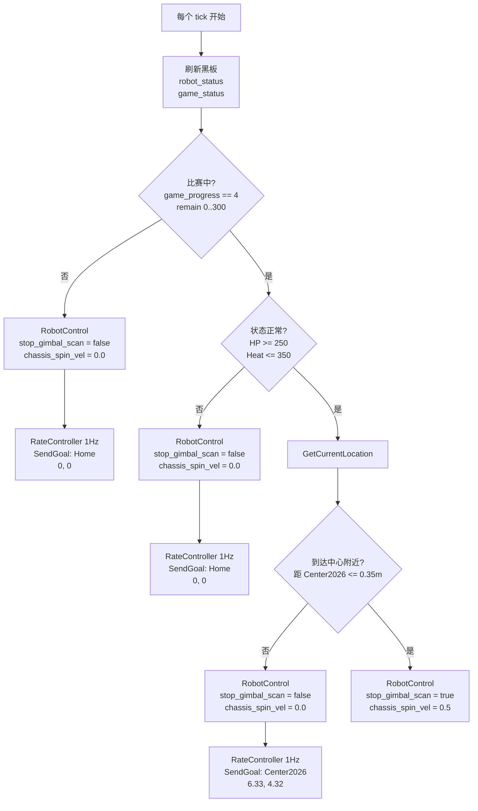

# 当前行为树流程图

最后更新：2026-03-19

这份文档现在优先说明你当前更适合调试的简化行为树 `center_attack_simple.xml`。

先把“当前到底跑哪棵树”说清楚：

- 推荐调试 / 机械限制版：
  - `rm_decision_ws/rm_behavior_tree/config/center_attack_simple.xml`
- `run_test_a.sh` / `run_test_a_headless.sh` 当前默认启动：
  - `style:=center_attack_simple`
- `start_robot.sh` 目前仍然默认启动旧树：
  - `style:=retreat_attack_left`

所以如果你现在是在调“开赛去中心、到点驻守攻击、低血回家”这套逻辑，应该以 `center_attack_simple.xml` 为准。

## 1. 先说结论

`center_attack_simple.xml` 是一个面向当前机械限制的简化状态机：

- 比赛开始且状态正常：
  - 去 `RMUL2026` 中心附近自由点
  - 行进中保持云台扫描
  - 底盘不小陀螺
- 到达中心附近：
  - 停止扫描，把云台交给自瞄
  - 底盘原地小陀螺
  - 不再继续主动行进
- 未开赛，或低血 / 高热：
  - 返回初始点 `Home(0.8, 7.8)`
  - 云台继续 360 扫描
  - 底盘不小陀螺

它和旧树最大的区别是：

- 不再依赖视觉检测结果切战术
- 不再依赖 `/all_robot_hp`
- 不再做时间窗切点位
- 不再在行进过程中小陀螺
- 只保留你当前最想要的 3 个状态：
  - 待机 / 回家
  - 去中心
  - 中心驻守攻击

## 2. 对应代码入口

- 行为树主程序：
  - `rm_decision_ws/rm_behavior_tree/src/rm_behavior_tree.cpp`
- 当前简化树 XML：
  - `rm_decision_ws/rm_behavior_tree/config/center_attack_simple.xml`
- 新增到点判断节点：
  - `rm_decision_ws/rm_behavior_tree/plugins/condition/is_near_goal.cpp`
- Groot 工程：
  - `rm_decision_ws/rm_behavior_tree/config/Project.btproj`

## 3. 当前输入与输出

### 3.1 输入

这棵新树每个 tick 只读取 2 路输入：

- `robot_status`
- `game_status`

和旧树不同，当前简化树不依赖：

- `/detector/armors`
- `/all_robot_hp`

### 3.2 输出

- `SendGoal`
  - 给 Nav2 的 `navigate_to_pose`
- `RobotControl`
  - 发布到 `/robot_control`
  - 目前只包含：
    - `stop_gimbal_scan`
    - `chassis_spin_vel`

## 4. 哪些输入是硬前提

- `game_status`
  - 最关键的门控输入
  - 如果没收到，或者 `game_progress != 4`，树不会进入比赛中主逻辑
- `robot_status`
  - 决定是否允许守中
  - 如果 `HP < 250` 或 `shooter_heat > 350`，树会直接回家

## 5. 关键目标点与阈值

当前 `center_attack_simple.xml` 里写死的是：

- `Home`
  - `(0.8, 7.8)`
- `Center2026`
  - `(6.33, 4.32)`
- `IsNearGoal` 距离阈值
  - `0.35 m`
- 驻守时底盘小陀螺速度
  - `0.5 rad/s`
- 状态阈值
  - `HP >= 250`
  - `shooter_heat <= 350`

之所以不是旧树里的 `OccupyCenter(3.0, 0.4)`，是因为那个点在当前 `RMUL2026.pgm` 上已经落在障碍区域里，不能直接复用。

## 6. 主流程图



## 7. 按代码展开后的结构图

```text
ReactiveSequence
├─ SubRobotStatus(topic_name="robot_status")
├─ SubGameStatus(topic_name="game_status")
└─ WhileDoElse [比赛进行中?]
   ├─ TRUE -> WhileDoElse [HP>=250 且 Heat<=350 ?]
   │  ├─ TRUE -> WhileDoElse [距离 Center2026 <= 0.35m ?]
   │  │  ├─ TRUE  -> RobotControl(stop_gimbal_scan=True,  chassis_spin_vel=0.5)
   │  │  └─ FALSE -> ReactiveSequence
   │  │     ├─ RobotControl(stop_gimbal_scan=False, chassis_spin_vel=0.0)
   │  │     └─ SendGoal(Center2026)
   │  └─ FALSE -> ReactiveSequence
   │     ├─ RobotControl(stop_gimbal_scan=False, chassis_spin_vel=0.0)
   │     └─ SendGoal(HomeRecover)
   └─ FALSE -> ReactiveSequence
      ├─ RobotControl(stop_gimbal_scan=False, chassis_spin_vel=0.0)
      └─ SendGoal(HomeStandby)
```

## 8. 关键节点速查

### 8.1 `IsGameTime`

成功条件：

- `msg->game_progress == 4`
- 且 `stage_remain_time` 在给定区间内

在这棵树里的作用：

- 只负责判断“比赛是否已经开始”

### 8.2 `IsStatusOK`

成功条件：

- `current_hp >= hp_threshold`
- `shooter_heat <= heat_threshold`

在这棵树里固定使用：

- `HP >= 250`
- `Heat <= 350`

### 8.3 `GetCurrentLocation`

作用：

- 读取当前 `map -> base_link` 的 TF
- 给后面的 `IsNearGoal` 做位置判断

### 8.4 `IsNearGoal`

成功条件：

- 当前机器人位置到目标点的平面距离 `<= dist_threshold`

当前用于：

- 判断是否已经到达 `Center2026`

### 8.5 `RobotControl`

当前树只通过两个量表达云台 / 底盘状态：

- `stop_gimbal_scan=false`
  - 云台继续扫描
- `stop_gimbal_scan=true`
  - 停止扫描，交给自瞄或下游控制
- `chassis_spin_vel=0.0`
  - 不小陀螺
- `chassis_spin_vel=0.5`
  - 原地小陀螺

## 9. 当前通讯链路里它是怎么落到底盘的

这棵树输出的两条控制链目前分别是：

- `SendGoal -> Nav2 -> /cmd_vel -> /cmd_vel_chassis -> bt_comm_adapter.py -> /cmd_vel_chassis_bt`
- `/robot_control.chassis_spin_vel -> bt_comm_adapter.py -> /cmd_vel_chassis_bt`

然后再通过当前桥接链进入底盘：

- `/cmd_vel_chassis_bt -> serial_sender -> Radar PTY -> sentry_bridge.py -> SX -> nyush-rm-control`

也就是说：

- 导航移动已经能通过这棵树真正影响底盘
- `chassis_spin_vel` 也已经能通过适配层叠加到底盘速度里
- `stop_gimbal_scan` 目前仍然只是 ROS 侧 `/robot_control` 话题

如果后面你要让“停止扫描 / 切自瞄”也真正通过串口落到下位机，还需要继续扩展桥接协议或下位机协议。

## 10. 这棵树当前不做什么

`center_attack_simple.xml` 当前故意不做这些事：

- 不看 `/detector/armors`
- 不看目标类别
  - 哨兵 / 步兵 / 英雄 / 前哨站
- 不做时间窗切换
- 不做左路 / 右路 / 补给区 / 中路多点位切换
- 不做被攻击后的 `MoveAround`

这是有意简化后的结果，目的是先让“去中心驻守”这套最小策略稳定跑起来。

## 11. 调试建议

如果你现在要调这棵树，最小只需要保证下面两路输入稳定：

- `game_status`
- `robot_status`

最小联调顺序：

1. 启动 Gazebo / Nav2
2. 启动行为树：
   - `style:=center_attack_simple`
3. 手动发布：
   - `game_status`
   - `robot_status`
4. 观察：
   - `/goal_pose`
   - `/robot_control`
   - Groot2 中的 `IsGameStart / IsStatusOK / IsNearGoal`

典型测试现象：

- `game_progress = 0`
  - 应回 `Home(0.8, 7.8)`
  - 扫描开启
  - 不小陀螺
- `game_progress = 4` 且 `HP = 600, heat = 0`
  - 应去 `Center2026(6.33, 4.32)`
  - 扫描开启
  - 不小陀螺
- 到 `Center2026` 附近后
  - 应 `stop_gimbal_scan=True`
  - 应 `chassis_spin_vel=0.5`
- `HP = 200` 或 `heat = 400`
  - 应回 `Home(0.8, 7.8)`
  - 扫描开启
  - 不小陀螺

## 12. 旧树现状说明

为了避免混淆，这里再强调一次：

- `retreat_attack_left.xml` 还在
- `start_robot.sh` 目前默认仍然起的是它
- 它仍然是那套旧的“时间窗 + 是否见敌 + 友方血量”的复杂高层导航状态机

如果你后面要正式把整套入口都切到新逻辑，下一步最自然的收尾就是把：

- `start_robot.sh`

也改成默认启动：

- `style:=center_attack_simple`
