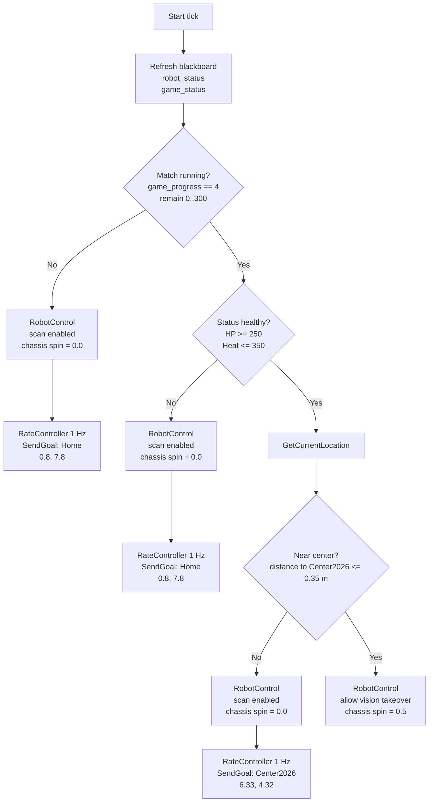

# Current Behavior-Tree Flow

<div align="center">

[](README_BEHAVIOR_TREE_FLOW.md)
[](README_BEHAVIOR_TREE_FLOW_EN.md)

</div>

Last updated: 2026-04-11

## 0. Documentation Scope

| Document | Responsibility |
|---|---|
| [README_EN.md](README_EN.md) | Central index: project overview, architecture, build order, and shortest startup path |
| [README_COMMUNICATION_EN.md](README_COMMUNICATION_EN.md) | Bridge, SP/SX/ST, PTYs, serial frames, topic paths, and real-robot communication |
| **This document** | Strategy XML, flow diagrams, nodes and plugins, `RobotControl` / `SendGoal`, Groot2, debugging scripts, and legacy-tree index |
| [README_LIDAR_EN.md](README_LIDAR_EN.md) | LiDAR, SLAM, Nav2, Gazebo Sim2Real, mapping, and real-robot localization |
| [README_COMMANDS_EN.md](README_COMMANDS_EN.md) | End-to-end data paths, `start_robot` variables, maps, commands, and staged real-robot integration |

Use this document to edit XML or understand decision and `RobotControl` behavior. Use the communication guide for MCU packets, the LiDAR guide for localization, and the commands guide for copy-ready terminal workflows.

End-to-end component ownership is defined in the commands guide. Map replacement, `MAP_FILE`, and PCD-to-PGM operations also belong there; this guide focuses on keeping tree coordinates and watcher parameters aligned with the XML.

The primary tree described here is the current debugging default, `center_attack_simple.xml`, followed by framework-level details and an index of legacy trees such as `retreat_attack_left`.

Current defaults:

- Recommended debugging/mechanical-limit tree: `rm_decision_ws/rm_behavior_tree/config/center_attack_simple.xml`
- `run_test_a.sh` and `run_test_a_headless.sh`: `style:=center_attack_simple`
- `start_robot.sh`: `style:=center_attack_simple`

These entry points therefore run the same “move to center, hold and attack, return home on low HP” policy.

## 1. Summary

`center_attack_simple.xml` is a deliberately small state machine for the robot's current mechanical constraints.

- Match running and status healthy:
  - Navigate to a free point near the RMUL2026 center.
  - Keep the gimbal scanning while moving.
  - Do not chassis-spin during translation.
- Near the center:
  - Stop the pure scan and permit auto-aim takeover.
  - Spin the chassis in place.
  - Do not issue another active movement goal.
- Match not running, low HP, or high shooter heat:
  - Return to `Home(0.8, 7.8)`.
  - Continue a 360-degree gimbal scan.
  - Disable chassis spin.

Compared with the legacy tree, this tree does not branch on vision detections, `/all_robot_hp`, time windows, or multi-waypoint tactics. It keeps only three states: home/standby, approach center, and center hold/attack.

## 2. Code Entry Points

- Behavior-tree executable: `rm_decision_ws/rm_behavior_tree/src/rm_behavior_tree.cpp`
- Current simplified XML: `rm_decision_ws/rm_behavior_tree/config/center_attack_simple.xml`
- Near-goal condition: `rm_decision_ws/rm_behavior_tree/plugins/condition/is_near_goal.cpp`
- Groot project: `rm_decision_ws/rm_behavior_tree/config/Project.btproj`

## 3. Inputs and Outputs

### 3.1 Inputs

The simplified tree reads only two inputs on each tick:

- `robot_status`
- `game_status`

Unlike the legacy tree, it does not depend on `/detector/armors` or `/all_robot_hp`.

Not subscribing to `/detector/armors` does not make vision irrelevant. Vision tracking still follows the vision → SP → MCU path. The tree uses `RobotControl` fields such as `allow_vision_control` and `scan_enabled` to switch between scanning and vision takeover; target visibility is simply not a branch condition in this XML.

### 3.2 Outputs

- `SendGoal`
  - Sends a Nav2 `navigate_to_pose` goal.
- `RobotControl`
  - Publishes `/robot_control`.
  - The XML sets fields according to the moving or holding branch:
    - `stop_gimbal_scan`, `chassis_spin_vel`
    - `scan_enabled`, `allow_vision_control`, `search_when_target_lost`
    - `scan_yaw_rate_deg_s`, `search_pitch_deg`

## 4. Required Inputs

- `game_status` is the primary gate. Without a message, or while `game_progress != 4`, the tree does not enter its in-match path.
- `robot_status` controls whether center hold is allowed. If HP is below 250 or shooter heat exceeds 350, the tree returns home.

## 5. Goals and Thresholds

Values currently hard-coded in `center_attack_simple.xml`:

| Item | Value |
|---|---|
| `Home` | `(0.8, 7.8)` |
| `Center2026` | `(6.33, 4.32)` |
| `IsNearGoal` distance | `0.35 m` |
| Chassis spin while holding | `0.5 rad/s` |
| Healthy HP | `HP >= 250` |
| Healthy shooter heat | `shooter_heat <= 350` |

The old `OccupyCenter(3.0, 0.4)` point lies inside an obstacle on the current `RMUL2026.pgm` and must not be reused directly.

### 5.1 Align `watch_center_attack_state.py` with XML Coordinates

The watcher's `d_home` and `d_center` reference points come from command-line options. Its historical defaults may not match `Home(0.8, 7.8)` and `Center2026(6.33, 4.32)`, so pass the XML coordinates explicitly:

```bash
python3 scripts/watch_center_attack_state.py \
  --home-x 0.8 --home-y 7.8 \
  --center-x 6.33 --center-y 4.32
```

Whenever the map, origin, or field orientation changes, verify all of the following together:

- XML `SendGoal` coordinates.
- `BT_START_GOAL` / `BT_END_GOAL` environment values.
- Watcher coordinates.

See [README_COMMANDS_EN.md](README_COMMANDS_EN.md) for map-point selection and staged real-robot testing.

## 6. Main Flow



## 7. Expanded Tree Structure

```text
ReactiveSequence
├─ SubRobotStatus(topic_name="robot_status")
├─ SubGameStatus(topic_name="game_status")
└─ WhileDoElse [match running?]
   ├─ TRUE -> WhileDoElse [HP >= 250 and heat <= 350?]
   │  ├─ TRUE -> WhileDoElse [distance to Center2026 <= 0.35 m?]
   │  │  ├─ TRUE  -> RobotControl(stop_gimbal_scan=True,  chassis_spin_vel=0.5)
   │  │  └─ FALSE -> ReactiveSequence
   │  │     ├─ RobotControl(stop_gimbal_scan=False, chassis_spin_vel=0.0)
   │  │     └─ SendGoal(Center2026)
   │  └─ FALSE -> ReactiveSequence
   │     ├─ RobotControl(stop_gimbal_scan=False, chassis_spin_vel=0.0)
   │     └─ SendGoal(HomeRecover)
   └─ FALSE -> ReactiveSequence
      ├─ RobotControl(stop_gimbal_scan=False, chassis_spin_vel=0.0)
      └─ SendGoal(HomeStandby)
```

## 8. Key Nodes

### 8.1 `IsGameTime`

Succeeds when `msg->game_progress == 4` and `stage_remain_time` is within the configured interval. In this tree it answers only whether the match has started.

### 8.2 `IsStatusOK`

Succeeds when `current_hp >= hp_threshold` and `shooter_heat <= heat_threshold`. This tree uses HP 250 and heat 350.

### 8.3 `GetCurrentLocation`

Reads the current `map -> base_link` transform for the following `IsNearGoal` condition.

### 8.4 `IsNearGoal`

Succeeds when planar distance from the current robot position to the goal is no greater than `dist_threshold`. It currently detects arrival at `Center2026`.

### 8.5 `RobotControl`

The node expresses gimbal and chassis state through functional fields:

- `scan_enabled`: enable gimbal scanning.
- `allow_vision_control`: permit vision auto-aim takeover.
- `search_when_target_lost`: return to scanning after losing a target.
- `scan_yaw_rate_deg_s`: scan yaw rate.
- `search_pitch_deg`: scan/search pitch target.
- `chassis_spin_vel`: chassis spin rate.
- `stop_gimbal_scan`: legacy compatibility field for stopping scan and permitting takeover; no longer the only control value.

## 9. How Tree Output Reaches the Chassis

The two control paths are:

```text
SendGoal -> Nav2 -> /cmd_vel -> /cmd_vel_chassis
         -> bt_comm_adapter.py -> /cmd_vel_chassis_bt

/robot_control.chassis_spin_vel -> bt_comm_adapter.py -> /cmd_vel_chassis_bt
```

The bridge path then carries the result to the chassis:

```text
/cmd_vel_chassis_bt -> serial_sender -> Radar PTY
                    -> sentry_bridge.py -> SX -> nyush-rm-control
```

Navigation translation and `chassis_spin_vel` therefore both affect the real chassis. Functional `/robot_control` fields also reach the MCU through `serial_sender(A3) -> sentry_bridge.py -> SX.control_flags/config`. At center hold, the tree can simultaneously enable chassis spin, allow auto-aim takeover, restore search after target loss, and configure scan yaw rate and pitch.

## 10. Deliberate Omissions

`center_attack_simple.xml` intentionally does not:

- Read `/detector/armors`.
- Branch by target type such as sentry, infantry, hero, or outpost.
- Switch goals by match-time window.
- Choose left, right, supply-zone, and center waypoints.
- Run `MoveAround` after being attacked.

The aim is to stabilize the smallest useful “approach and hold center” policy first.

## 11. Debugging Workflow

Only `game_status` and `robot_status` are required for the minimum test.

1. Start Gazebo and Nav2.
2. Start the tree with `style:=center_attack_simple`.
3. Publish `game_status` and `robot_status` manually.
4. Observe `/goal_pose`, `/robot_control`, and `IsGameStart` / `IsStatusOK` / `IsNearGoal` in Groot2.

Expected scenarios:

| Input | Expected behavior |
|---|---|
| `game_progress = 0` | Return to Home, scan enabled, no chassis spin |
| `game_progress = 4`, `HP = 600`, `heat = 0` | Navigate to Center2026, scan enabled, no chassis spin |
| Pose near Center2026 | `stop_gimbal_scan=True`, `chassis_spin_vel=0.5` |
| `HP = 200` or `heat = 400` | Return to Home, scan enabled, no chassis spin |

## 12. Legacy-Tree Status

`retreat_attack_left.xml` remains available, but `start_robot.sh` now defaults to `center_attack_simple`. The old tree is a more complex time-window, enemy-detection, and teammate-HP navigation state machine. Use it only when explicitly setting `BT_STYLE=retreat_attack_left` and when all of its inputs are available.

## 13. Program Entry, Parameters, and Plugins

### 13.1 Executable and Tick Loop

- Source: `rm_decision_ws/rm_behavior_tree/src/rm_behavior_tree.cpp`
- Behavior: creates a `BehaviorTreeFactory`, registers plugins in order, constructs a tree from XML, and executes `tree.tickWhileRunning(10ms)`.
- Launch:

  ```bash
  ros2 launch rm_behavior_tree rm_behavior_tree.launch.py \
    style:=<XML filename without extension> use_sim_time:=True
  ```

The launch file normally expands `style` to an absolute `config/<style>.xml` path.

### 13.2 Common Node Parameters

| Parameter | Meaning |
|---|---|
| `style` | Behavior-tree XML to load, such as `center_attack_simple` |
| `start_goal_pose` / `end_goal_pose` | Global blackboard pose strings used by some trees and debugging tools |
| `enable_groot` | Enable Groot2 publishing |
| `groot_port` | Groot2 monitoring port; default `1667` |

### 13.3 Registered ROS Subscriber Plugins (`msg_update_plugin_libs`)

These plugins refresh blackboard values on each tick:

| Library | Typical input |
|---|---|
| `sub_all_robot_hp` | `/all_robot_hp` |
| `sub_robot_status` | `robot_status`, with XML-configurable topic name |
| `sub_game_status` | `game_status` |
| `sub_armors` | `/detector/armors` |

Registration does not imply a runtime dependency. `center_attack_simple.xml` does not instantiate `SubArmors` or `SubAllRobotHP`.

### 13.4 Registered Non-ROS Plugins (`bt_plugin_libs`)

| Plugin | Kind | Purpose |
|---|---|---|
| `rate_controller` | Decorator | Limits child execution rate, such as `SendGoal` at 1 Hz |
| `is_game_time` | Condition | Match phase and time window |
| `is_status_ok` | Condition | HP and heat thresholds |
| `is_detect_enemy` | Condition | Armor list is non-empty |
| `is_near_goal` | Condition | Distance to goal after `GetCurrentLocation` |
| `is_attacked` | Condition | Robot is under attack |
| `is_friend_ok` / `is_outpost_ok` | Condition | Teammate and outpost referee state |
| `get_current_location` | Synchronous action | Reads `map -> base_link` |
| `move_around` | Action | Evasive movement after attack |

### 13.5 ROS-Publishing Plugins (`RegisterRosNode`)

| Plugin | Default topic | Purpose |
|---|---|---|
| `send_goal` | `goal_pose` through `params_send_goal` | Nav2 `navigate_to_pose` |
| `robot_control` | `robot_control` through `params_robot_control` | Publishes `RobotControl` |

## 14. `RobotControl` Message and Node Ports

Definition: `rm_decision_ws/rm_decision_interfaces/msg/RobotControl.msg`

| Field | Type | Meaning |
|---|---|---|
| `stop_gimbal_scan` | bool | Legacy compatibility: stop scan and facilitate auto-aim takeover |
| `chassis_spin_vel` | float32 | Chassis spin rate in rad/s, written to `/cmd_vel_chassis_bt.angular.z` by `bt_comm_adapter` |
| `scan_enabled` | bool | Enable scan mode |
| `allow_vision_control` | bool | Permit vision auto-aim takeover |
| `search_when_target_lost` | bool | Resume searching after losing the target |
| `scan_yaw_rate_deg_s` | float32 | Scan yaw rate in deg/s |
| `search_pitch_deg` | float32 | Scan/search pitch target in degrees |

Implementation: `plugins/action/robot_control.cpp`. Ports not connected in XML use `0` / `false`, then `getInput` overwrites connected values.

## 15. XML Configuration Index

Files under `rm_behavior_tree/config/*.xml`:

| File | Purpose |
|---|---|
| `center_attack_simple.xml` | Default center-hold and low-HP-return policy; only `game_status` and `robot_status` |
| `center_attack_fullstack.xml` | Extended/full-stack center policy; verify its current launch usage against the actual XML |
| `retreat_attack_left.xml` | Legacy match policy with time windows, detections, teammate HP, and resupply |
| `attack_left.xml` / `attack_right.xml` | Single-side attacks |
| `protect_supply.xml` | Supply-zone defense |
| `rmuc_01.xml` | RMUC preset |

Switch trees with:

```bash
BT_STYLE=retreat_attack_left ./start_robot.sh
# or
ros2 launch rm_behavior_tree rm_behavior_tree.launch.py \
  style:=retreat_attack_left
```

## 16. `retreat_attack_left` Structure

The XML remains authoritative; this outline highlights the contrast with the simplified tree.

```text
ReactiveSequence (refresh subscriptions each tick)
├─ SubAllRobotHP, SubArmors, SubRobotStatus, SubGameStatus
└─ WhileDoElse [match running: game_progress = 4]
   ├─ TRUE  -> main tactics: enemy visible / status / attacked / time / teammate HP
   │           -> multiple SendGoal and RobotControl branches
   └─ FALSE -> standby: return to base and disable spin
```

This tree strongly depends on `/detector/armors` and `/all_robot_hp` and includes `MoveAround`, multiple goals, and time windows. Supply real referee and vision topics, or intentional debugging fallbacks, before using it.

## 17. Nav2, `bt_comm_adapter`, and MCU Integration

```text
SendGoal -> navigate_to_pose -> Nav2 -> /cmd_vel
         -> fake_vel_transform -> /cmd_vel_chassis

RobotControl -> /robot_control ----------------------------┐
                                                          ▼
                                         bt_comm_adapter -> /cmd_vel_chassis_bt
                                                          -> serial_sender
                                                          -> Radar PTY -> MCU
```

- Translation comes primarily from Nav2 through `/cmd_vel_chassis.linear.*`.
- Chassis spin comes from `chassis_spin_vel`. Do not assume Nav2 `angular.z` is forwarded by `bt_comm_adapter`; see `scripts/bt_comm_adapter.py`.

## 18. Debugging Tools

| Script | Purpose |
|---|---|
| `bt_hotkey_debug.py` | Publishes simulated `game_status` / `robot_status` and switches branches quickly |
| `watch_center_attack_state.py` | Prints center-attack state in a terminal |
| `run_test_a.sh` / `run_test_a_headless.sh` | No-LiDAR fake-sensor + Nav2 + BT test; defaults to `center_attack_simple` |
| `test_behavior_chain.py` | Behavior-chain test helper |
| `start_fullstack_sequence.sh` | Opens several GNOME terminals for cleanup, bridge, vision, navigation, watcher, and hotkeys |
| `start_fullstack_headless.sh` | Starts the stack without a GUI and writes logs; suitable for systemd/unattended use |

Manual two- or three-terminal integration remains preferable for routine debugging because it makes ownership and failures easier to see.

### 18.1 Groot2 Workflow

1. Start the installed Groot2 AppImage:

   ```bash
   cd ~/Desktop
   ./Groot2-v1.9.0-x86_64.AppImage
   ```

   Use the actual installed filename if its version differs.

2. Start `rm_behavior_tree` with `enable_groot:=true`. `run_center_attack_debug_session.sh` exposes this as `ENABLE_GROOT=True`.
3. Open `rm_behavior_tree/config/Project.btproj`.
4. Connect Monitor to `127.0.0.1:1667`, or the configured `groot_port`.
5. If the free edition reaches its node limit, temporarily reduce the XML to the branch under test.

For Gazebo integration, start `bringup_sim`, then `run_center_attack_debug_session.sh`, then connect Groot2.

### 18.2 `goal_pose` String Format

`SendGoal` expects:

```text
x;y;z; qx;qy;qz;qw
```

`bt_conversions.hpp` parses this into `geometry_msgs/PoseStamped`. Avoid unnecessary leading whitespace in XML values; historical parsing issues are partially mitigated by trimming in `parseDouble`.

## 19. Source Index

| Item | Path |
|---|---|
| Main program | `rm_decision_ws/rm_behavior_tree/src/rm_behavior_tree.cpp` |
| Groot project | `rm_decision_ws/rm_behavior_tree/config/Project.btproj` |
| `RobotControl` plugin | `rm_decision_ws/rm_behavior_tree/plugins/action/robot_control.cpp` |
| `SendGoal` | `rm_decision_ws/rm_behavior_tree/plugins/action/send_goal.cpp` |
| `IsNearGoal` | `rm_decision_ws/rm_behavior_tree/plugins/condition/is_near_goal.cpp` |
| Message definitions | `rm_decision_ws/rm_decision_interfaces/msg/*.msg` |
| Communication adapter | `scripts/bt_comm_adapter.py` |

## 20. Related Documentation

| Need | Document |
|---|---|
| End-to-end paths, real-robot terminals, and `ros2 topic pub` | [README_COMMANDS_EN.md](README_COMMANDS_EN.md) |
| MCU protocol for `RobotControl` and `serial_sender` | [README_COMMUNICATION_EN.md](README_COMMUNICATION_EN.md) |
| `MAP_FILE`, map replacement, and point selection | [README_COMMANDS_EN.md](README_COMMANDS_EN.md) |
| Gazebo, `bringup_sim`, Sim2Real, and simulated referee input | [README_LIDAR_EN.md](README_LIDAR_EN.md) and [mid360 command.txt](mid360%20command.txt) |
| `navigate_to_pose` and localization consistency | [README_LIDAR_EN.md](README_LIDAR_EN.md) |
| Central project index | [README_EN.md](README_EN.md) |
