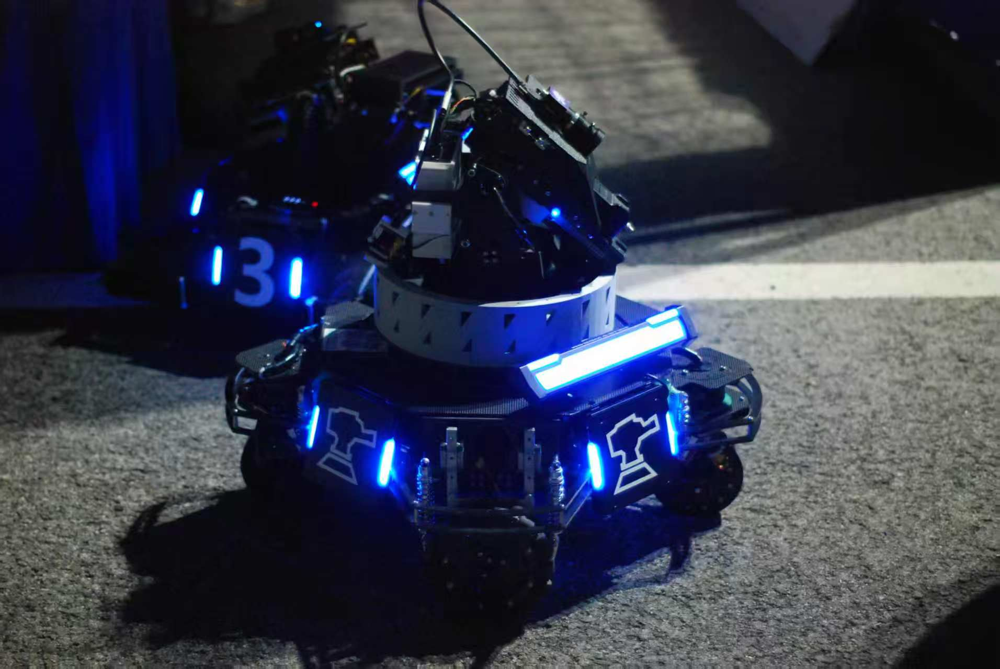
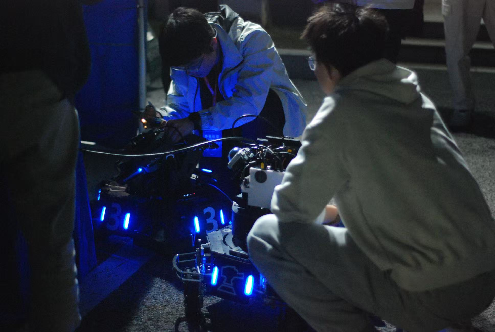

<div align="center">

# NYUSH RM Sentry

**Autonomous navigation, behavior-tree decision making, and system integration for a RoboMaster sentry robot**


[](LICENSE)

[](README.md)
[](README_EN.md)

</div>

<p align="center">
  
  
</p>

<p align="center"><sub>NYUSH Robotics sentry robot and field integration</sub></p>

## Overview

`nyush_rm_sentry` (formerly `sentry_planner`) is the planning and system-integration repository for the **NYUSH Robotics** sentry robot. It adapts the open-source stack from SMBU PolarBear and combines LiDAR localization, Nav2 navigation, BehaviorTree.CPP decision making, and bridge-based serial communication with `nyush-rm-control` and `nyush-rm-vision` into one workflow.

### Key Capabilities

| Area | Capabilities |
|---|---|
| Localization and perception | Livox Mid-360, FAST-LIO, point-cloud-to-LaserScan conversion, map and TF management |
| Autonomous navigation | Nav2 path planning, velocity-command adaptation, waypoint navigation, and return-to-home behavior |
| Tactical decision making | BehaviorTree.CPP, Groot2 visualization projects, and switchable strategy trees |
| System communication | Single-USB CDC bridge, Radar / Vision PTYs, and SP plus SX/ST protocol paths |
| Simulation | Gazebo Classic 11, the RMUL2026 environment, and a Sim2Real validation workflow |

## Architecture

```text
        Mid-360 ──► livox_ros_driver2 ──► FAST-LIO ──► point cloud + odometry
                         │
                         └──► pointcloud_to_laserscan ──► /scan ──► Nav2
                                       │
Nav2 /cmd_vel ──► fake_vel_transform ──► /cmd_vel_chassis ──► bt_comm_adapter
                                                                            │
BT /goal_pose ──► Nav2               BT /robot_control ──► serial_sender ────┤
                                                                            ▼
Vision ◄──► Vision PTY ◄──► sentry_bridge ◄──► /dev/ttyACM0 ◄──► control MCU
LiDAR/navigation ◄──► Radar PTY ◄────┘
```

> [!IMPORTANT]
> `sentry_bridge` must be the only process that opens the physical USB serial port. Vision and LiDAR/navigation processes connect to the Vision PTY and Radar PTY created by the bridge.

Planar spin is currently taken from `/robot_control.chassis_spin_vel`; `bt_comm_adapter` writes it to `/cmd_vel_chassis_bt.angular.z` instead of using Nav2's `angular.z`. See [README_COMMANDS_EN.md §1](README_COMMANDS_EN.md#1-end-to-end-data-paths-and-responsibilities) for the complete data paths and component ownership.

## Documentation

The root README provides the project overview and shortest onboarding path. Protocol details, tuning notes, and troubleshooting procedures live in the focused guides below.

| Document | Scope |
|---|---|
| [README_COMMUNICATION_EN.md](README_COMMUNICATION_EN.md) | Communication architecture, `sentry_bridge`, PTYs, SP/SX/ST, serial frames, ROS 2 topics, and real-robot communication checks |
| [README_BEHAVIOR_TREE_FLOW_EN.md](README_BEHAVIOR_TREE_FLOW_EN.md) | Strategy trees, nodes and plugins, `RobotControl`, Nav2 integration, Groot2, and debugging scripts |
| [README_LIDAR_EN.md](README_LIDAR_EN.md) | Mid-360, FAST-LIO, SLAM, Nav2, Gazebo RMUL2026, tuning, and localization troubleshooting |
| [README_COMMANDS_EN.md](README_COMMANDS_EN.md) | End-to-end data flow, launch commands, environment variables, maps, mapping, and staged real-robot bring-up |

Command references:

- [communication command.txt](communication%20command.txt): copy-ready communication commands; use `README_COMMANDS_EN.md` as the source of truth for behavior and parameters.
- [mid360 command.txt](mid360%20command.txt): step-by-step Gazebo, Nav2, behavior-tree, and Groot2 commands.

## Repositories and Workspaces

| Path / Repository | Responsibility |
|---|---|
| **This repository, `nyush_rm_sentry`** | Launch orchestration, navigation workspace, behavior-tree workspace, communication adapters, and debugging tools |
| **`~/nav_ws`** | External navigation dependencies including Livox drivers, FAST-LIO, and Nav2 parameters; sourced by `start_robot.sh` |
| [**nyush-rm-control**](https://github.com/NYUSH-Robotics-Club/nyush-rm-control) (team repository; access required) | STM32 firmware, chassis and gimbal control, and `sentry_bridge` |
| [**nyush-rm-vision**](https://github.com/NYUSH-Robotics-Club/nyush-rm-vision) (team repository; access required) | Armor detection, tracking, auto-aim, and the vision-side serial path |

## Requirements

- Ubuntu 22.04
- ROS 2 Humble
- Gazebo Classic 11 (simulation only)
- Livox Mid-360 and its driver (real-robot localization)

## Build Order

The workspaces depend on one another. Build them in this order:

1. `nav_ws` (including `livox_ros_driver2`)
2. `nyush_rm_sentry/rm_vision_ws`
3. `nyush_rm_sentry/rm_decision_ws` (after sourcing `rm_vision_ws`)
4. `nyush_rm_sentry/rm_navigation_ws` (after sourcing `nav_ws`)

See [README_COMMANDS_EN.md](README_COMMANDS_EN.md) and each workspace README for full commands, dependencies, and common build errors.

## Quick Start on the Robot

1. Start the MCU bridge from `nyush-rm-control`. It owns the USB CDC port and prints the Radar and Vision PTY paths:

   ```bash
   just sentry-bridge
   ```

2. Start navigation, the behavior tree, and the LiDAR-side serial sender from this repository:

   ```bash
   START_SERIAL_SENDER=1 RADAR_PTY=<Radar_PTY> ./start_robot.sh
   ```

3. If vision is required, set `com_port` in `nyush-rm-vision`'s `sentry.yaml` to the Vision PTY, then follow the vision repository's launch procedure.

`start_robot.sh` does not start `sentry_bridge` automatically. See §4 and §12 of [README_COMMANDS_EN.md](README_COMMANDS_EN.md) for port selection, environment variables, and the complete checklist.

## Recommended Validation Path

Validate the stack in stages: **Gazebo RMUL2026 and Nav2 tuning → bench communication and behavior-tree checks → low-speed localization and return-to-home tests in a small area → full-field integration**. Start with [README_LIDAR_EN.md §6.4](README_LIDAR_EN.md#nyush-gazebo-sim2real) and use [mid360 command.txt](mid360%20command.txt) for step-by-step commands.

## Credits and License

This project adapts and extends [SMBU-POLARBEAR/RM2024_SMBU_auto_sentry_ws](https://gitee.com/SMBU-POLARBEAR/RM2024_SMBU_auto_sentry_ws) and related open-source components. We thank their authors and contributors.

The project is distributed under the [MIT License](LICENSE). NYUSH-specific protocol and chassis changes—including the 19-byte radar frame, `ref_yaw`, and sentry swerve-drive integration—are defined by `README_COMMUNICATION_EN.md` and the control repository implementation.

---

<div align="center">

The root README maintains a stable overview; focused guides and current code remain the source of truth for implementation details.

</div>
